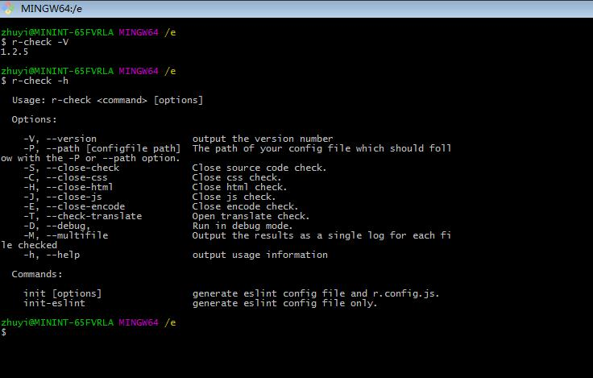

# r-check
r-check是一个组内用于一些基本检查的一个工具。  
能够预防一些基本的错误。  
主要的检查内容有：  

- 语法规范检查
- 翻译检查  
- 编码格式检查  

1.语法规范扩展于htmlHint&&csslint&&ESLint    
2.翻译检查主要检查： 

- 代码中的词条是否都在语言包中  
- 代码中是否存在中文这种没有翻译的词条  
- 检查语言包json文件与资料部给出的excel文件是否一一对应  
- 检查资料部给出的excel文件是否有重复词条(一对多的情况)  

3.编码格式检查主要检查所有文件格式是否为UTF-8格式(有无BOM均可)。来避免因为编码异常改变导致的错误。  

#安装
1.npm install reasy-html-hint-node -g (记得加入-g命令全局安装，安装时会自动生成r-check.cmd脚本文件)  
2.下载完成后输入r-check -V（大写）来检查是否安装成功    
3.进入需要检查的项目根目录  
4.在cmd黑色窗口里运行r-check即可检查  
5.检查之后会在更目录多出一个errorLog文件夹，errorLog文件夹下有html及css两个子文件夹，分别保存两者的错误信息  
6.在cmd中，可以输入r-check -V查看当前版本  
7.在cmd中,输入r-check -h查看其他配置参数，配置参数具体用法参考[CLI参数](#CLI参数)  

#目录结构

	r-check:   
	├─bin   //二进制文件,用于生成r-check.cmd  并解析输入的配置参数    
	├─common //默认配置，utils  
	├─custom-csslint  //自定义的csslint插件  
	│  └─dist  
	├─custom-htmlhint  //自定义的htmlhint插件  
	│
	├─libs          //源文件代码  
	│  ├─code-check //检查代码规范的
	│  │  ├─ cssTest.js  //检查css源码规范，使用cssLint插件  
	│  │  ├─ htmlTest.js //检查html源码规范,使用htmlHint插件  
	│  │  ├─ jsTest.js   // 检查js源码规范，使用ESLint插件  
	│  │  └─ sourceCodetest.js  //用于检查配置参数是否正确，控制检查的开启与关闭  
	│  ├─encode-check     
	│  │  └─ checkEncode.js //检查编码格式  	
	│  │  	
	│  ├─initConfig   
	│  │  └─ initConfig.js //用于执行 init指令生成配置文件  	
	│  └─translate-check   //用于翻译检查  
	│  
	├─test          //用于测试的代码    
	└─index.js      //入口文件     

## CLI参数 
使用r-check -v 查看版本号(当前版本@1.2.6)  
使用r-check -h 可以查看帮助信息  
运行r-check 检查目录下编码规范及翻译检查。
帮助信息显示如下  

 Usage: r-check <command> [options]

  Options:

    -V, --version                 output the version number  
    -P, --path [configfile path]  The path of your config file which should follow with the -P or --path option.  
    -S, --close-check             Close source code check.  
    -C, --close-css               Close css check.  
    -H, --close-html              Close html check.    
    -J, --close-js                Close js check.  
    -E, --close-encode            Close encode check.  
    -T, --check-translate         Open translate check.  
    -D, --debug,                  run in debug mode.  
    -h, --help                    output usage information  

  Commands:

    init                          generate eslint config file and r.config.js.  
    init-eslint                   generate eslint config file only.  

# r-check 配置文件生成方法  

1. 使用指令 r-check init  
   该指令将会生成3个文件，分别是r.config.js  &&  .eslintrc.js  &&  .eslintignore  
2. 使用指令 r-check init-eslint  
   该指令会生成两个文件，分别是.eslintrc.js  &&  .eslintignore  
3. 如果这三个文件已经存在于当前目录，r-check init不会重新生成配置文件。如果你需要更新这些文件的话，请使用r-check init --force来强制生成。

这三个文件的作用  
  r.config.js:用于配置翻译检查的参数以及html、css语法规范的检查配置。  
  .eslintrc.js:用于配置ESLint插件的语法规范检查规则(组内统一)。此规则同时也将应用于你的IDE（如果你装了ESLint插件的话）  
  .eslintignore:用于配置ESLint应该忽略的文件(比如node_modules)  

# r-check **&lt;options&gt;** 
r-check指令后可以跟上一些选项来选择关闭某些检查  

### -M or --multifile  配置输出日志的格式  
>  输出的错误日志默认是单个文件的形式，保存在各自的文件夹下。
>  如果你偏好每个错误日志对应其错误的文件，请使用-M参数

e.g:
>  r-check -M

### -S or --close-check 关闭代码规范检查  
>  输入此指令后将不会检查代码规范    
>  包括html,css,js代码规范   

e.g:
>  r-check -S 

或者  

>  r-check --close-check

### -C or--close-css关闭css检查  
### -H or --close-html关闭html检查  
### -J or --close-js关闭js检查     
**注意：**所有的短指令是可以组合起来的  
但是长指令不可以  
e.g:
>  例如 r-check -CHJ

等价于

>  r-check -C -H -J

等价于

>  r-check --close-css --close-html --close-js  

### -E or --close-encode **关闭编码检查**  
编码检查会检查你的文件是否为UTF-8格式(有无BOM均可，但必须是UTF8)。  
以避免在前后台在编码格式上出现错误，以及在IE8下的显示问题。    
编码检查虽然是必须的，但是编码检查会进行大量的IO操作，建议检查一次确认没有问题之后手动关闭。  
e.g:  
>  r-check -E

### -T or --check-translate **开启翻译检查**  
因为不一定所有的产品需要翻译检查。  
当开启翻译检查却没有检查到语言包或者翻译检查的相关配置项时会报错。   
翻译检查的配置在r.config.js中配置。  
具体配置项如下:  

    //配置项中有重复的项是为了配置方便，避免出现混淆。请在每个检查下都配置一遍  
    module.exports = {
      "jsonAndCode": { //检查源码中每条翻译是否在json中都由对应的词条
         "jsonPath": "./app/common/lang",     //***必填   json文件的上级目录的上级目录   因为可能有多国语言的情况
         "codePath": "./app",                 //***必填  代码的路径，如果就是本地  输入./即可
         "logPath": "./errorLog"              //***选填  错误日志的路径，不填默认为 ./errorLog
       },
      "jsonAndExcel": { //检查json文件和excel文件的词条是否一一对应
         "jsonPath": "./app/common/lang", //***必填   json文件的上级目录的上级目录   因为可能有多国语言的情况
         "excelPath": "./docs/O3.xlsx",   //***必填   语言包的路径
         "logPath": "./errorLog",         //***选填   错误日志的路径，不填默认为 ./errorLog
         "defaultLang": "en",             //***必填   默认的语言，excel文件中以这种语言为基准
         "langToCheck": ["cn"]            //***必填   需要检查的语言项，必须要能在excel文件中找到
       },
      "checkDuplicate": { //检查excel中是否有重复的词条。重复词条会导致翻译的一对多问题
         "excelPath": "./test/O3.xlsx", //***必填   语言包的路径、
         "defaultLang": "en",           //***必填   默认的语言，excel文件中以这种语言为基准
         "logPath": "./errorLog"        //***选填   错误日志的路径，不填默认为 ./errorLo
       }
    };

##配置文件  
配置文件包含四个部分  
- HTML语法检查规则  
- CSS语法检查规则 
- 翻译检查配置 
- 错误日志路径  

配置文件详细使用请参照[配置文件规则Wiki](https://github.com/Zhuyi731/r-check/wiki/Config-Files-Detail "配置文件规则Wiki")

	

#开发及扩展  
npm install 安装的是压缩版本  
开发版本请到[github](https://github.com/Zhuyi731/r-check.git)下载 
 
或者使用git bash下载至本地  
git clone https://github.com/Zhuyi731/r-check.git   

##目录结构
	  
	│  
	├─compressed          //压缩后的代码，用于发布
	│  
	├─reasy-htmlcss-hint-node   //开发时的代码
	│  └─code
	│
	├─gulpfile.js    //gulp相关配置文件