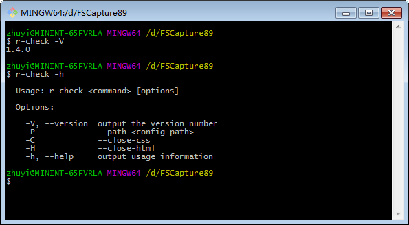

# reasy-html-hint-node
扩展于htmlHint&&csslint  
用于Node环境下检查css和html的语法规范

#安装
1.npm install reasy-html-hint-node -g (记得加入-g命令全局安装，安装时会自动生成r-check.cmd脚本文件)  
2.下载完成后输入r-check -V（大写）来检查是否安装成功    
3.进入需要检查的项目根目录  
4.在cmd黑色窗口里运行r-check即可检查  
5.检查之后会在更目录多出一个errorLog文件夹，errorLog文件夹下有html及css两个子文件夹，分别保存两者的错误信息  
6.在cmd中，可以输入r-check -V查看当前版本  
7.在cmd中,输入r-check -h查看其他配置参数，配置参数具体用法参考[CLI参数](#CLI参数)  

#目录结构
	r-check: 
	├─bin   //二进制文件,用于生成r-check.cmd  并解析输入的配置参数
	├─common //默认配置，utils  
	├─custom-csslint  //自定义的csslint插件  
	│  └─dist  
	├─custom-htmlhint  //自定义的htmlhint插件  
	│
	├─libs          //源文件代码  
	│  ├─code-check //检查代码规范的
	│  │  ├─ cssTest.js  //检查css源码规范，使用cssLint插件
	│  │  ├─ htmlTest.js //检查html源码规范,使用htmlHint插件
	│  │  ├─ jsTest.js   // 检查js源码规范，使用ESLint插件
	│  │  └─ sourceCodetest.js  //用于检查配置参数是否正确，控制检查的开启与关闭
	│  ├─encode-check 
	│  │  └─ checkEncode.js //检查编码格式	
	│  │	
	│  ├─encode-check 
	│  │  └─ initConfig.js //用于执行 init指令生成配置文件	
	│  └─translate-check   //用于翻译检查
	│  
	├─test          //用于测试的代码  
	└─index.js      //入口文件     

## CLI参数 
使用r-check -v 查看版本号(当前版本@1.1.5)  
使用r-check -h 可以查看帮助信息  
运行r-check 检查目录下编码规范及翻译检查。
帮助信息显示如下  

 Usage: r-check <command> [options]

  Options:

    -V, --version                 output the version number  
    -P, --path [configfile path]  The path of your config file which should follow with the -P or --path option.  
    -S, --close-check             Close source code check.  
    -C, --close-css               Close css check.  
    -H, --close-html              Close html check.    
    -J, --close-js                Close js check.  
    -E, --close-encode            Close encode check.  
    -T, --check-translate         Open translate check.  
    -D, --debug,                  run in debug mode.  
    -h, --help                    output usage information  

  Commands:

    init                          generate eslint config file and r.config.js.  
    init-eslint                   generate eslint config file only.  

# r-check 配置文件生成方法  

1. 使用指令 r-check init  
   该指令将会生成3个文件，分别是r.config.js  &&  .eslintrc.js  &&  .eslintignore  
2. 使用指令 r-check init-eslint  
   该指令会生成两个文件，分别是.eslintrc.js  &&  .eslintignore  

这三个文件的作用  
  r.config.js:用于配置翻译检查的参数以及html、css语法规范的检查配置。  
  .eslintrc.js:用于配置ESLint插件的语法规范检查规则(组内统一)。此规则同时也将应用于你的IDE（如果你装了ESLint插件的话）  
  .eslintignore:用于配置ESLint应该忽略的文件(比如node_modules)  

# r-check **命令选项** 
r-check指令后可以跟上一些选项来选择关闭某些检查  

### -S or --close-check 关闭代码规范检查  
>  输入此指令后将不会检查代码规范    
>  包括html,css,js代码规范   

e.g:
>  r-check -S 

或者  

>  r-check --close-check

### -C or--close-css关闭css检查  
### -H or --close-html关闭html检查  
### -J or --close-js关闭js检查     
**注意：**所有的短指令是可以组合起来的  
但是长指令不可以  
e.g:
>  例如 r-check -CHJ

等价于

>  r-check -C -H -J

等价于

>  r-check --close-css --close-html --close-js  

### -E or --close-encode **关闭编码检查**  
编码检查会检查你的文件是否为UTF-8格式(有无BOM均可，但必须是UTF8)。  
以避免在前后台在编码格式上出现错误，以及在IE8下的显示问题。    
编码检查虽然是必须的，但是编码检查会进行大量的IO操作，建议检查一次确认没有问题之后手动关闭。  
e.g:  
>  r-check -E

### -T or --check-translate **开启翻译检查**  
因为不一定所有的产品需要翻译检查。  
当开启翻译检查却没有检查到语言包或者翻译检查的相关配置项时会报错。   
翻译检查的配置在r.config.js中配置。  
具体配置项如下:  

    //配置项中有重复的项是为了配置方便，避免出现混淆。请在每个检查下都配置一遍  
    module.exports = {
      "jsonAndCode": { //检查源码中每条翻译是否在json中都由对应的词条
         "jsonPath": "./app/common/lang",     //***必填   json文件的上级目录的上级目录   因为可能有多国语言的情况
         "codePath": "./app",                 //***必填  代码的路径，如果就是本地  输入./即可
         "logPath": "./errorLog"              //***选填  错误日志的路径，不填默认为 ./errorLog
       },
      "jsonAndExcel": { //检查json文件和excel文件的词条是否一一对应
         "jsonPath": "./app/common/lang", //***必填   json文件的上级目录的上级目录   因为可能有多国语言的情况
         "excelPath": "./docs/O3.xlsx",   //***必填   语言包的路径
         "logPath": "./errorLog",         //***选填   错误日志的路径，不填默认为 ./errorLog
         "defaultLang": "en",             //***必填   默认的语言，excel文件中以这种语言为基准
         "langToCheck": ["cn"]            //***必填   需要检查的语言项，必须要能在excel文件中找到
       },
      "checkDuplicate": { //检查excel中是否有重复的词条。重复词条会导致翻译的一对多问题
         "excelPath": "./test/O3.xlsx", //***必填   语言包的路径、
         "defaultLang": "en",           //***必填   默认的语言，excel文件中以这种语言为基准
         "logPath": "./errorLog"        //***选填   错误日志的路径，不填默认为 ./errorLo
       }
    };

##配置文件  
配置文件包含四个部分  
- HTML语法检查规则  
- CSS语法检查规则 
- 翻译检查配置 
- 错误日志路径  

默认配置文件配置如下  

	var options = {
    "htmlCheckOptions": {
        //标签名 小写
        "tagname-lowercase": true,
        //属性名称小写
        "attr-lowercase": false,
        //属性值使用双引号    
        "attr-value-double-quotes": true,
        //属性值不能为空    
        "attr-value-not-empty": false,
        //属性值不能重定义    
        "attr-no-duplication": true,
        //html标签在头部    
        "doctype-first": false,
        //标签配对    
        "tag-pair": true,
        //标签自闭    
        "tag-self-close": false,
        //id唯一
        "id-unique": true,
        //src非空
        "src-not-empty": true,
        //title必须    
        "title-require": false,
        //alt必须    
        "alt-require": false,
        //<!DOCTYPE>检查
        "doctype-html5": false,
        //文件内部样式禁止    
        "style-disabled": false,
        //内联css机制    
        "inline-style-disabled": false,
        //内联js禁止    
        "inline-script-disabled": false,
        //属性特殊字符检查    
        "attr-unsafe-chars": false,
        //头部js文件检查
        "head-script-disabled": false,
		//自定义规则
		//检查IE 头部是否加入meta进行兼容
		'IE-meta':true,
		"placeholder":true
    },
    //英文原文文档
    //https://github.com/CSSLint/csslint/wiki/
    "cssCheckOptions": {
        //是否检测 !important
        "important": false,
        //是否允许 .bar.foo 这种两个连在一起的选择器
        "adjoining-classes": false,
        //未知属性检测
        "known-properties": false,
        //重复属性检测
        "duplicate-properties": true,
        //border-box 和 box-sizing检测
        "box-sizing": false,
        //width、height 与 border  padding值一起使用时 发出警告
        "box-model": false,
        //display与一些其他值不能同时使用  
        //如 inline 不能与height同时使用   block不能使用 vertical-align   table-*不能使用float
        "display-property-grouping":true,
        //不允许使用重复的背景图片   如果是精灵图  背景图在一个公共的类里引用 其他类用于调整位置
        "duplicate-background-images":true,
        //gradient 这种需要跨浏览器兼容的属性应该写在一起  避免漏改
        "gradients":true,
        //rgba  hsl  hsla这种类型的颜色会提出警告
        "fallback-colors":true,
        //font-size的声明不应该超过10条  
        "font-sizes":false,
        //@font-face  这种外部字体规则不要引入太多
        "font-faces":false,
        //float条数超过10条时，警告
        "floats":false,
        //以*开头的属性检测    如  *width  检测到会报错
        "star-property-hack":false,
        //以_开头的属性检测
        "underscore-property-hack":false,
        //若有  outline:0 或 outline:none的情况并且选择器没有:focus伪类  警告   
        //或者选择器有:focus伪类 但是只有outline一条属性 警告
        "outline-none":false,
        //不允许导入css  @import url(more.css);
        "import":true,
        //id选择器不要放在头部  例如  #head a{}这种  应该单独使用  因为css解析从右向左解析，这样反而降低了效率
        "ids":false,
        //h1-h6应该在头部定义 而不能再子类中再次定义 例如.box h3 {font-weight: normal;}是不行的
        //.item:hover h3 { font-weight: bold; } 也是不行的    正确的是  h3{font-weight:normal}
        "qualified-headings":false,
        //如果你把 margin的top bottom left right都定义一遍就警告你！╭(╯^╰)╮   如果只定义了其中1~2个不会警告
        //正确食用  margin:20px 10px 5px 11px;
        "shorthand":true,
        //text-indent不能使用负值  除非同属性direction:ltr一起出现
        "text-indent":false,
        //h1-h6 只应该被定义一次   伪类不算
        "unique-headings":false,
        //若*选择器 是key选择器的话(最右边那个) 警告
        "universal-selector":false,
        //类似于[type=text]的选择器作为key选择器的时候  浏览器会先把所有的节点匹配  然后去检查他们的type属性会降低效率
        "unqualified-attributes":false,
        //不能只有前缀属性，没有通用属性  -moz-border-radius  并且通用属性必须在最后
        "vendor-prefix":false,
        //不允许 0px  0% 0em
        "zero-units":true,
		//自定义的规则
		//opacity属性需要做兼容性处理
		"opacity":false
    },
	"jsonAndCode": { //检查源码中每条翻译是否在json中都由对应的词条
	 "jsonPath": "./app/common/lang",     //***必填   json文件的上级目录的上级目录   因为可能有多国语言的情况
	 "codePath": "./app",                 //***必填  代码的路径，如果就是本地  输入./即可
	 "logPath": "./errorLog"              //***选填  错误日志的路径，不填默认为 ./errorLog
   },
  "jsonAndExcel": { //检查json文件和excel文件的词条是否一一对应
	 "jsonPath": "./app/common/lang", //***必填   json文件的上级目录的上级目录   因为可能有多国语言的情况
	 "excelPath": "./docs/O3.xlsx",   //***必填   语言包的路径
	 "logPath": "./errorLog",         //***选填   错误日志的路径，不填默认为 ./errorLog
	 "defaultLang": "en",             //***必填   默认的语言，excel文件中以这种语言为基准
	 "langToCheck": ["cn"]            //***必填   需要检查的语言项，必须要能在excel文件中找到
   },
  "checkDuplicate": { //检查excel中是否有重复的词条。重复词条会导致翻译的一对多问题
	 "excelPath": "./test/O3.xlsx", //***必填   语言包的路径、
	 "defaultLang": "en",           //***必填   默认的语言，excel文件中以这种语言为基准
	 "logPath": "./errorLog"        //***选填   错误日志的路径，不填默认为 ./errorLo
   },
    "errorLogPath": "./errorLog"
	};

	module.exports = options;

#开发及扩展  
npm install 安装的是压缩版本  
开发版本请到[github](https://github.com/Zhuyi731/reasy-htmlcss-hint-node.git)下载  
下载至本地git clone https://github.com/Zhuyi731/reasy-htmlcss-hint-node.git   

##目录结构
	  
	│  
	├─compressed          //压缩后的代码，用于发布
	│  
	├─reasy-htmlcss-hint-node   //开发时的代码
	│  └─code
	│
	├─gulpfile.js    //gulp相关配置文件